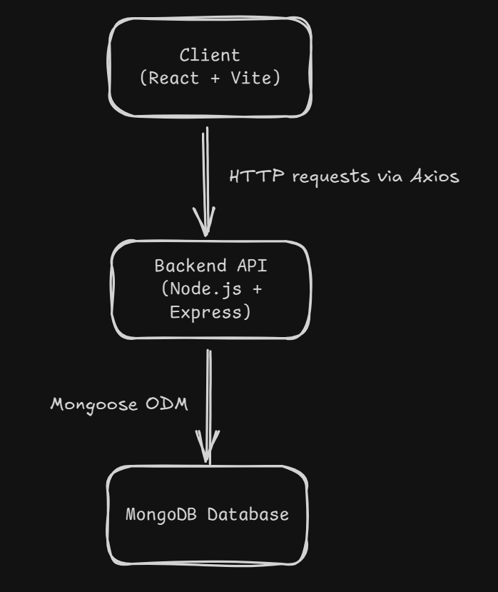
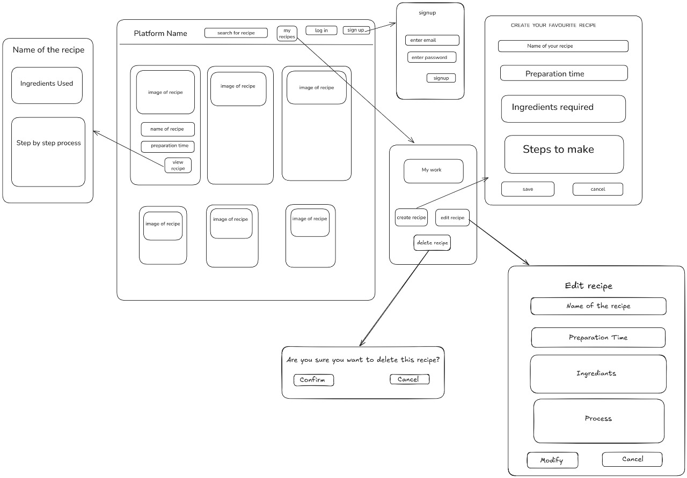

<div align="center">


# BitBook

*Cook, Share, Inspire — Your Culinary Community Awaits*

**TEAM_ID:** `nH5bh4-kyTIS37VlTtAoe`

</div>

A modern full stack web application for sharing, discovering, and managing recipes. This platform enables users to create accounts, post their own recipes, explore dishes from others, and interact with a vibrant cooking community.

---

## Table of Contents

- [Overview](#overview)
- [Features](#features)
- [Tech Stack](#tech-stack)
- [Architecture](#architecture)
- [Getting Started](#getting-started)
  - [Prerequisites](#prerequisites)
  - [Installation](#installation)
- [API Reference](#api-reference)
- [Screenshots & Demos](#screenshots--demos)
- [Directory Structure](#directory-structure)
- [Contributing](#contributing)
- [Roadmap](#roadmap)
- [FAQ](#faq)
- [License](#license)
- [Contact](#contact)
- [Acknowledgments](#acknowledgments)

---

## Overview

BitBook is a full-stack web application designed to empower users to discover, share, and manage culinary recipes in a community-driven environment. Built with a React frontend and a Node.js backend, it offers a seamless experience for recipe exploration and collaboration.

### Why BitBook?

This project streamlines recipe sharing and management with a focus on security, scalability, and user engagement. The core features include:

-  **React & Vite Integration**: Rapid frontend development with hot module replacement and streamlined UI components.
-  **Secure Authentication**: Role-based access control and JWT-based user sessions ensure data protection.
-  **API-Driven Data Management**: Robust CRUD operations for recipes and users facilitate dynamic content handling.
-  **Modular Architecture**: Clear separation of frontend and backend layers for maintainability and scalability.
-  **Community Focus**: Designed to foster collaboration and culinary exchange among users.

---

## Features

- **User Authentication & Authorization:**  
  Secure registration, login, and protected routes using JWT-based authentication.

- **Recipe Management:**  
  Create, view, edit, and delete your own recipes with support for ingredients and preparation steps.

- **Recipe Search:**  
  Find recipes easily by searching dish names with partial and case-insensitive matching.

- **Personal Recipe Collection:**  
  View all recipes you have created in your personal dashboard.

- **Pagination:**  
  Browse recipes efficiently with paginated results for large collections.

- **RESTful APIs:**  
  Well-structured endpoints for easy integration and scalability.

- **Robust Input Validation:**  
  Ensures all recipe data is complete and valid before submission.

- **Error Handling:**  
  Clear and consistent error responses for invalid requests or server issues.

---

## Architecture

BitBook follows a clean separation of concerns with a modern full stack architecture:

<p align="center">
  
</p>


---

## Tech Stack

BitBook is built using a modern, modular stack for scalability and maintainability:

- **Frontend**
  - [React.js](https://react.dev/) — Component-based UI library for building interactive interfaces.
  - [Vite](https://vitejs.dev/) — Fast frontend build tool and development server.
  - [React Router](https://reactrouter.com/) — Client-side routing for single-page applications.
  - [Axios](https://axios-http.com/) — Promise-based HTTP client for API requests.

- **Backend**
  - [Node.js](https://nodejs.org/) — JavaScript runtime for server-side development.
  - [Express.js](https://expressjs.com/) — Web framework for building APIs and backend logic.
  - [Mongoose](https://mongoosejs.com/) — MongoDB object modeling for Node.js.
  - [bcrypt](https://www.npmjs.com/package/bcrypt) — Password hashing for secure authentication.
  - [jsonwebtoken (JWT)](https://www.npmjs.com/package/jsonwebtoken) — Token-based user authentication and route protection[3].

- **Database**
  - [MongoDB](https://www.mongodb.com/) — NoSQL database for storing recipes, users, and related data.

- **Deployment & DevOps**
  - [Git](https://git-scm.com/) & [GitHub](https://github.com/) — Version control and collaboration.
  - [Vercel](https://vercel.com/) — (Optional) Cloud platform for frontend deployment.
  - [npm](https://www.npmjs.com/) — Package manager for JavaScript dependencies.

**Key Architecture Highlights:**
- Modular file organization for APIs, middleware, and image management.
- Secure authentication and route protection using bcrypt and JWT.
- Responsive, search-focused frontend with robust routing.

---

## Getting Started

### Prerequisites

This project requires the following dependencies and tools:

- **JavaScript** 
- **HTML** — Structure and markup for web pages 
- **CSS** — Styling and layout for web pages 
- **Frontend Framework:** React.js (with Vite)  
- **Backend Framework:** Express.js 
- **Authentication:** JWT (jsonwebtoken)
- **Package Manager:** npm 
- **Node.js:** v14+ 
- **MongoDB:** 
- **Git:** 
- **nodemon** 
  - (Optional, for development) Automatically restarts the backend server on code changes.

*Optional for Deployment:*
- **Vercel Account & CLI** (for deployment) 

---

## Installation

### Steps

1. **Clone the repository**
   ```bash
       git clone https://github.com/GryffinX/Recipe_Sharing_Platform.git
       cd Recipe_Sharing_Platform

2. **Install Backend Dependencies**
   ```bash
      cd backend
      npm install
3. **Install Frontend Dependencies**
   ```bash
      cd ../frontend
      npm install
4. Set up environment variables.
   
   Create a .env file in the backend directory and add:
   ```env
      PORT = 3000
      MONGO_DB_USERNAME = your_mongoDB_username
      MONGO_DB_PASSWD = your_mongoDB_password
      MONGO_DB_ENDPOINT = your_mongoDB_endpoint
      MONGO_DB_DATABASE = your_database_name
      JWT_SECRET = your_jwt_secret_string
      JWT_EXPIRY = your_jwt_expiry_time
6. Start the backend server
   ```bash
      cd backend
      npm start
      (or) npm run dev
7. Start the frontend server
   ```bash
      cd ../frontend
      npm start
      (or) npm run dev

---

## API Reference

Below are the main API endpoints for BitBook's backend. Each endpoint is briefly described for quick reference.


### **GET `/recipes/`**
Fetch a paginated list of all recipes.  
**Query Parameters:**  
- `page` (optional): Page number (default: 1)  
- `limit` (optional): Number of recipes per page (default: 10)

---

### **GET `/recipes/search`**
Search for recipes by dish name (case-insensitive, partial matches allowed).  
**Query Parameters:**  
- `q` (required): The dish name to search for.

---

### **GET `/recipes/my`**
Retrieve all recipes created by the authenticated user.  
**Headers:**  
- `Authorization: Bearer <JWT>`

---

### **POST `/recipes/`**
Create a new recipe.  
**Headers:**  
- `Authorization: Bearer <JWT>`  
**Body:**  
- `dishName` (string, required)  
- `timeTaken` (string/number, required)  
- `ingredients` (array or comma-separated string, required)  
- `process` (array or comma-separated string, required)

---

### **PATCH `/recipes/:id`**
Update an existing recipe by its ID. Only provided fields will be updated.  
**Headers:**  
- `Authorization: Bearer <JWT>`  
**Body:**  
- Any of: `dishName`, `timeTaken`, `ingredients`, `process`

---

### **DELETE `/recipes/:id`**
Delete a recipe by its ID.  
**Headers:**  
- `Authorization: Bearer <JWT>`

---

**Notes:**  
- All endpoints return JSON responses.
- Protected routes require a valid JWT token in the `Authorization` header.

---

## Screenshots & Demos

Below are wireframes and screenshots illustrating the main sections and user flows of BitBook.

---

### **Platform Structure & UI Flow**



**Description of Sections:**
- **Main Feed:** Displays recipe cards with images, names, and preparation times.
- **Recipe Detail:** Shows ingredients and a step-by-step process for a selected recipe.
- **Signup/Login:** Forms for user authentication.
- **User Dashboard ("My work"):** Allows users to create, edit, or delete their recipes.
- **Recipe Creation/Editing:** Forms for entering recipe name, preparation time, ingredients, and steps.
- **Delete Confirmation:** Dialog for confirming recipe deletion.

---
