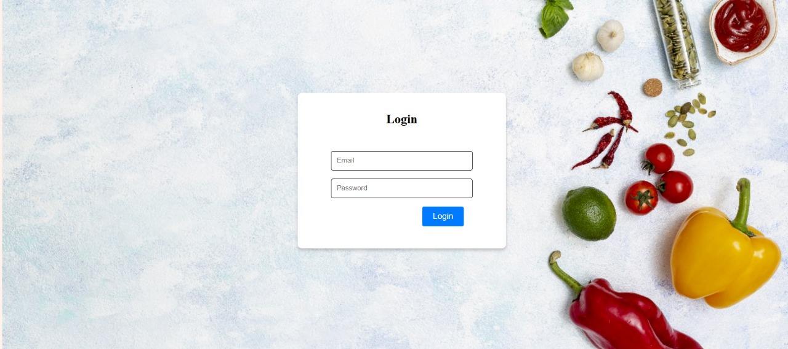

<div align="center">


# BiteBook

*Cook, Share, Inspire — Your Culinary Community Awaits*

**TEAM_ID:** `nH5bh4-kyTIS37VlTtAoe`

</div>

A modern full stack web application for sharing, discovering, and managing recipes. This platform enables users to create accounts, post their own recipes, explore dishes from others, and interact with a vibrant cooking community.

---

## Table of Contents

- [Overview](#overview)
- [Features](#features)
- [Tech Stack](#tech-stack)
- [Architecture](#architecture)
- [Getting Started](#getting-started)
  - [Prerequisites](#prerequisites)
  - [Installation](#installation)
- [API Reference](#api-reference)
- [Site Walkthrough](#site-walkthrough)
- [License](#license)
- [Contact](#contact)

---

## Overview

BiteBook is a full-stack web application designed to empower users to discover, share, and manage culinary recipes in a community-driven environment. Built with a React frontend and a Node.js backend, it offers a seamless experience for recipe exploration and collaboration.

### Why BiteBook?

This project streamlines recipe sharing and management with a focus on security, scalability, and user engagement. The core features include:

-  **React & Vite Integration**: Rapid frontend development with hot module replacement and streamlined UI components.
-  **Secure Authentication**: Role-based access control and JWT-based user sessions ensure data protection.
-  **API-Driven Data Management**: Robust CRUD operations for recipes and users facilitate dynamic content handling.
-  **Modular Architecture**: Clear separation of frontend and backend layers for maintainability and scalability.
-  **Community Focus**: Designed to foster collaboration and culinary exchange among users.

---

## Features

- **User Authentication & Authorization:**  
  Secure registration, login, and protected routes using JWT-based authentication.

- **Recipe Management:**  
  Create, view, edit, and delete your own recipes with support for ingredients and preparation steps.

- **Recipe Search:**  
  Find recipes easily by searching dish names with partial and case-insensitive matching.

- **Personal Recipe Collection:**  
  View all recipes you have created in your personal dashboard.

- **Pagination:**  
  Browse recipes efficiently with paginated results for large collections.

- **RESTful APIs:**  
  Well-structured endpoints for easy integration and scalability.

- **Robust Input Validation:**  
  Ensures all recipe data is complete and valid before submission.

- **Error Handling:**  
  Clear and consistent error responses for invalid requests or server issues.

---

## Architecture

BiteBook follows a clean separation of concerns with a modern full stack architecture:

<p align="center">
  
</p>


---

## Tech Stack

BiteBook is built using a modern, modular stack for scalability and maintainability:

- **Frontend**
  - [React.js](https://react.dev/) — Component-based UI library for building interactive interfaces.
  - [Vite](https://vitejs.dev/) — Fast frontend build tool and development server.
  - [React Router](https://reactrouter.com/) — Client-side routing for single-page applications.
  - [Axios](https://axios-http.com/) — Promise-based HTTP client for API requests.

- **Backend**
  - [Node.js](https://nodejs.org/) — JavaScript runtime for server-side development.
  - [Express.js](https://expressjs.com/) — Web framework for building APIs and backend logic.
  - [Mongoose](https://mongoosejs.com/) — MongoDB object modeling for Node.js.
  - [bcrypt](https://www.npmjs.com/package/bcrypt) — Password hashing for secure authentication.
  - [jsonwebtoken (JWT)](https://www.npmjs.com/package/jsonwebtoken) — Token-based user authentication and route protection[3].

- **Database**
  - [MongoDB](https://www.mongodb.com/) — NoSQL database for storing recipes, users, and related data.

- **Deployment & DevOps**
  - [Git](https://git-scm.com/) & [GitHub](https://github.com/) — Version control and collaboration.
  - [Vercel](https://vercel.com/) — (Optional) Cloud platform for frontend deployment.
  - [npm](https://www.npmjs.com/) — Package manager for JavaScript dependencies.

**Key Architecture Highlights:**
- Modular file organization for APIs, middleware, and image management.
- Secure authentication and route protection using bcrypt and JWT.
- Responsive, search-focused frontend with robust routing.

---

## Getting Started

### Prerequisites

This project requires the following dependencies and tools:

- **JavaScript** 
- **HTML** — Structure and markup for web pages 
- **CSS** — Styling and layout for web pages 
- **Frontend Framework:** React.js (with Vite)  
- **Backend Framework:** Express.js 
- **Authentication:** JWT (jsonwebtoken)
- **Package Manager:** npm 
- **Node.js:** v14+ 
- **MongoDB:** 
- **Git:** 
- **nodemon** 
  - (Optional, for development) Automatically restarts the backend server on code changes.

*Optional for Deployment:*
- **Vercel Account & CLI** (for deployment) 

---

## Installation

### Steps

1. **Clone the repository**
   ```bash
       git clone https://github.com/GryffinX/Recipe_Sharing_Platform.git
       cd Recipe_Sharing_Platform

2. **Install Backend Dependencies**
   ```bash
      cd backend
      npm install
3. **Install Frontend Dependencies**
   ```bash
      cd ../frontend
      npm install
4. Set up environment variables.
   
   Create a .env file in the backend directory and add:
   ```env
      PORT = 3000
      MONGO_DB_USERNAME = your_mongoDB_username
      MONGO_DB_PASSWD = your_mongoDB_password
      MONGO_DB_ENDPOINT = your_mongoDB_endpoint
      MONGO_DB_DATABASE = your_database_name
      JWT_SECRET = your_jwt_secret_string
      JWT_EXPIRY = your_jwt_expiry_time
6. Start the backend server
   ```bash
      cd backend
      npm start
      (or) npm run dev
7. Start the frontend server
   ```bash
      cd ../frontend
      npm start
      (or) npm run dev

---

## API Reference

Below are the main API endpoints for BiteBook's backend. Each endpoint is briefly described for quick reference.


### **GET `/recipes/`**
Fetch a paginated list of all recipes.  
**Query Parameters:**  
- `page` (optional): Page number (default: 1)  
- `limit` (optional): Number of recipes per page (default: 10)

---

### **GET `/recipes/search`**
Search for recipes by dish name (case-insensitive, partial matches allowed).  
**Query Parameters:**  
- `q` (required): The dish name to search for.

---

### **GET `/recipes/my`**
Retrieve all recipes created by the authenticated user.  
**Headers:**  
- `Authorization: Bearer <JWT>`

---

### **POST `/recipes/`**
Create a new recipe.  
**Headers:**  
- `Authorization: Bearer <JWT>`  
**Body:**  
- `dishName` (string, required)  
- `timeTaken` (string/number, required)  
- `ingredients` (array or comma-separated string, required)  
- `process` (array or comma-separated string, required)

---

### **PATCH `/recipes/:id`**
Update an existing recipe by its ID. Only provided fields will be updated.  
**Headers:**  
- `Authorization: Bearer <JWT>`  
**Body:**  
- Any of: `dishName`, `timeTaken`, `ingredients`, `process`

---

### **DELETE `/recipes/:id`**
Delete a recipe by its ID.  
**Headers:**  
- `Authorization: Bearer <JWT>`

---

**Notes:**  
- All endpoints return JSON responses.
- Protected routes require a valid JWT token in the `Authorization` header.

---

## Site Walkthrough

Below are wireframes and screenshots illustrating the main sections and user flows of BiteBook.

---

### **Platform Structure & UI Flow**


### Homepage
 
 ---
 


The **BiteBook homepage** welcomes users with a visually engaging feed of the latest and most popular recipes shared by the community. Key features of the homepage include:

- **Recipe Feed:** Displays recipe cards with images, dish names, preparation times allowing users to quickly browse and discover new recipes.
- **Search Bar:** Prominently placed at the top, enabling users to search for recipes by name.
- **Navigation Menu:** Easy access to login, signup, user dashboard, and other core sections.
- **Responsive Design:** The layout adapts seamlessly to both desktop and mobile devices, ensuring a smooth user experience for everyone.
- **Call to Action:** Encourages visitors to join the community by signing up or sharing their own recipes.

_This homepage serves as the gateway to BiteBook’s vibrant culinary community, making it easy for users to explore and get inspired right from the start._

---

### Signup & Login Pages


---


BiteBook provides secure and user-friendly authentication screens for both new and returning users:

- **Signup Page:**  
  Allows new users to create an account by providing essential details such as username, email, and password. Passwords are securely hashed using bcrypt, and the process is protected by validation to ensure data integrity.

- **Login Page:**  
  Enables registered users to log in with their credentials. Upon successful authentication, a JWT token is issued for secure, stateless session management. Middleware ensures that only authenticated users can access protected routes and features.

_Both pages are designed for clarity and ease of use, with clear form fields, validation feedback, and responsive layouts for all devices._

---

### Recipe Card & Detail View


When a user presses the **View Recipe** button on a recipe card, they are taken to a detailed view showcasing all the information about the selected recipe:

- **Recipe Image and Title:** A large, attractive image of the dish along with its name.
- **Time Taken:** Information about the preparation time.
- **Ingredients List:** Clearly presented, often as a checklist or bullet points for easy reference.
- **Step-by-Step Process:** Detailed instructions to help users to create the recipe.
- **Responsive Layout:** The detail view adapts to both desktop and mobile screens for optimal readability and interaction.

_This immersive detail page ensures users have all the information they need to successfully recreate the recipe, while also enabling community interaction and content management._

---

### User Dashboard ("My Recipes")


When a user presses the **My Recipes** button, they are taken to their personal dashboard. This section provides a centralized view and management panel for all recipes created by the user.

**Key features of the User Dashboard:**
- **Recipe List:** Displays all recipes authored by the user, each with options to view, edit, or delete.
- **Quick Actions:** Buttons or icons for editing and deleting recipes directly from the dashboard.
- **Create New Recipe:** Prominent button to add a new recipe, streamlining the content creation process.
- **Responsive Layout:** Ensures usability and accessibility on both desktop and mobile devices.

_The dashboard empowers users to efficiently manage their culinary contributions and maintain their personal collection on BiteBook._

---

### Creating a Recipe


---
<p align="center">
  
</p>

When a user clicks the **Create Recipe** button, they are taken to a dedicated form where they can add a new recipe to BiteBook.

**Key features of the Create Recipe page:**
- **Recipe Name:** Input field for the dish name.
- **Preparation Time:** Specify the time required to make the dish.
- **Ingredients:** Add ingredients as a list or by entering them as comma-separated values.
- **Process/Steps:** Enter the cooking process as step-by-step instructions, either as a list or in separate fields for clarity.
- **Submit Button:** Saves the new recipe to the user’s collection and makes it visible to the community.

_This intuitive and streamlined form makes it easy for users to contribute their favorite recipes, ensuring every submission is complete and well-structured._

---

## Database Structure
The **BiteBook** application uses MongoDB to store all user and recipe data. The database consists of two main collections: **users** and **recipes**.

---

### 1. Users Collection

Each document in the `users` collection represents a registered user of the platform.

**Schema Fields:**
- `username` (String, required, unique): The user’s display name.
- `email` (String, required, unique): The user’s email address.
- `password` (String, required): The user’s (hashed) password.
- `createdAt` (Date, default: current date): The date the account was created.
- `role` (String, enum: ['admin', 'user'], default: 'user'): User role for access control.

**Example Document:**

```bash
   {
  "_id": "64b7f1a2e1d3c4a5b6c7d8ea",
  "username": "alice_wonder",
  "email": "alice.wonder@example.com",
  "password": "hashedpassword",
  "createdAt": "2024-10-01T09:15:00.000Z",
  "role": "user"
  }
```
---

### 2. Recipes Collection

Each document in the `recipes` collection represents a recipe created by a user.

**Schema Fields:**
- `dishName` (String, required): The name of the dish.
- `timeTaken` (String, required): Preparation/cooking time.
- `ingredients` (Array of Strings, required): List of ingredients.
- `process` (Array of Strings, required): Step-by-step cooking instructions.
- `userID` (ObjectId, required, references `users`): The ID of the user who created the recipe.

**Example Document:**

```bash
   {
  "_id": "65c7f1a2e1d3c4a5b6c7d8eb",
  "dishName": "Granola Practical",
  "timeTaken": "35 minutes",
  "ingredients": ["Cheese", "Bread", "Tomato", "Butter"],
  "process": [
  "Mix all ingredients in a bowl.",
  "Bake at 180°C for 20 minutes.",
  "Let it cool before serving."
  ],
  "userID": "64b7f1a2e1d3c4a5b6c7d8ea"
  }
```

### Relationship

- Each recipe references a user via the `userID` field, establishing a one-to-many relationship:  
  **One user can create many recipes, but each recipe belongs to one user.**

---


---


---

## License

This project is licensed under the MIT License.

```bash
   MIT License

Copyright (c) 2025 Team BiteBook
GryffinX
Priyanka0542
Nakshatra2410
athvr-practicing


Permission is hereby granted, free of charge, to any person obtaining a copy
of this software and associated documentation files (the "Software"), to deal
in the Software without restriction, including without limitation the rights
to use, copy, modify, merge, publish, distribute, sublicense, and/or sell
copies of the Software, and to permit persons to whom the Software is
furnished to do so, subject to the following conditions:

The above copyright notice and this permission notice shall be included in
all copies or substantial portions of the Software.

THE SOFTWARE IS PROVIDED "AS IS", WITHOUT WARRANTY OF ANY KIND, EXPRESS OR
IMPLIED, INCLUDING BUT NOT LIMITED TO THE WARRANTIES OF MERCHANTABILITY,
FITNESS FOR A PARTICULAR PURPOSE AND NONINFRINGEMENT. IN NO EVENT SHALL THE
AUTHORS OR COPYRIGHT HOLDERS BE LIABLE FOR ANY CLAIM, DAMAGES OR OTHER
LIABILITY, WHETHER IN AN ACTION OF CONTRACT, TORT OR OTHERWISE, ARISING FROM,
OUT OF OR IN CONNECTION WITH THE SOFTWARE OR THE USE OR OTHER DEALINGS IN
THE SOFTWARE.
```

[2][3][4][6]

---

## Contact Us

For questions, feedback, or collaboration, reach out to us on GitHub:

- [@GryffinX](https://github.com/GryffinX)
- [@Priyanka0542](https://github.com/Priyanka0542)
- [@Nakshatra2410](https://github.com/Nakshatra2410)
- [@athvr-practicing](https://github.com/athvr-practicing)
